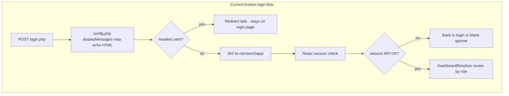

# Fix Room Browsing, Login Redirect, Theme, and Modal Layout

## Problem summary

| Issue | Root cause |
|-------|------------|
| Rooms page empty when not logged in | Frontend is public, but [`api/rooms/list.php`](api/rooms/list.php) calls `apiRequireLogin()` and returns 401 |
| Login does not land on admin dashboard | Multiple compounding issues: `displayMessages()` in [`includes/config.php`](includes/config.php) can emit HTML before redirect headers; session cookie `domain => 'localhost'` breaks on non-localhost hosts; login always sends users to `/version2/app/` instead of role-specific routes |
| Dark neon theme mismatch | React app uses dark palette + purple glow in [`app/src/index.css`](app/src/index.css); homepage uses light gray in [`style.css`](style.css) |
| Add Staff modal clipped | Modal renders inside `.page.animate-fade-in`, whose `transform` creates a stacking context below sticky TopBar (`z-index: 90`) |



---

## 1. Public view-only room browsing (no login)

**Already correct (no route changes needed):**
- [`homepage.php`](homepage.php) — "Rooms" / "View Rooms" link to `/version2/app/guest/rooms`
- [`app/index.php`](app/index.php) — whitelists `/guest/rooms` as a public route
- [`app/src/App.jsx`](app/src/App.jsx) — `/guest/rooms` is not wrapped in `ProtectedRoute`
- [`app/src/pages/guest/BrowseRooms.jsx`](app/src/pages/guest/BrowseRooms.jsx) — shows description, amenities, price; anonymous users get **Login to Book** instead of **Book Now**

**Required fix:**

In [`api/rooms/list.php`](api/rooms/list.php), remove `apiRequireLogin()` for this read-only GET endpoint. Room catalog data is not user-specific. Keep write/admin operations protected in [`api/rooms/manage.php`](api/rooms/manage.php) and booking in [`api/bookings/create.php`](api/bookings/create.php).

**UX polish for anonymous visitors:**

Add a minimal public header bar to `BrowseRooms.jsx` (only when `!user`):
- Logo / "Back to Home" link → `/version2/homepage.php`
- "Login" button → `/version2/auth/login.php?redirect=/version2/app/guest/rooms`

This gives guests a clear path back without requiring login.

---

## 2. Fix login redirect (admin / staff / guest)

### 2a. Stop `displayMessages()` from breaking redirects and API JSON

[`includes/config.php`](includes/config.php) line 117 unconditionally calls `displayMessages()` on every include. Any flash message outputs HTML **before** `header("Location: ...")` in [`auth/login.php`](auth/login.php), causing the redirect to fail silently and leaving the user on the login page even after a successful login.

**Fix:** Remove the global `displayMessages()` call from `config.php`. Call it only from HTML pages that need it ([`auth/login.php`](auth/login.php), [`auth/signup.php`](auth/signup.php), [`homepage.php`](homepage.php)).

For API endpoints, ensure clean JSON by either:
- Not calling `displayMessages()` at all (after removing global call), or
- Adding a guard at the top of [`api/auth/session.php`](api/auth/session.php) / [`api/api_helper.php`](api/api_helper.php) to skip HTML output

### 2b. Fix session cookie domain

In [`includes/config.php`](includes/config.php), change:

```php
'domain' => 'localhost',
```

to:

```php
'domain' => '',
```

Empty domain lets the browser bind the cookie to whatever host is used (`localhost`, `127.0.0.1`, etc.).

### 2c. Role-aware redirect after login

In [`auth/login.php`](auth/login.php), after setting session variables, redirect directly to the role dashboard instead of relying solely on `DashboardResolver`:

```php
$roleRedirects = [
    'admin' => '/version2/app/admin/dashboard',
    'staff' => '/version2/app/staff/dashboard',
    'guest' => '/version2/app/guest/dashboard',
];
$redirectTarget = $roleRedirects[$user['role']] ?? '/version2/app/';
// still honor safe ?redirect= param if it starts with /version2/app/
```

Also update the "already logged in" block at the top of `login.php` with the same logic.

### 2d. Preserve intended URL in app gate

In [`app/index.php`](app/index.php), when redirecting unauthenticated users:

```php
header("Location: /version2/auth/login.php?redirect=" . urlencode($requestPath));
```

### 2e. Rebuild React production bundle

Apache serves [`app/dist/`](app/dist/), not live source. After any React changes:

```bash
cd app && npm run build
```

---

## 3. Unify theme — light minimalist matching homepage

**Source of truth:** [`style.css`](style.css) `:root` variables (`--primary: #222`, white backgrounds, gray accents).

**Primary file:** [`app/src/index.css`](app/src/index.css)

Replace the dark palette with light tokens aligned to homepage:

| Token | Current (dark/neon) | Target (homepage) |
|-------|---------------------|-------------------|
| `--bg-app` | `#0a0a0f` | `#ffffff` / `#fdfdfd` |
| `--bg-sidebar` | `#0f0f16` | `#ffffff` |
| `--bg-card` | rgba glass | `#ffffff` with subtle shadow |
| `--primary` | `#262a35` + purple glow | `#222222` |
| `--text-primary` | `#f0f0f5` | `#111111` |
| `--border-color` | white alpha | `#e2e8f0` |

**Remove all purple/neon hardcoding:**
- `rgba(139, 92, 246, ...)` in buttons, focus rings, card gradients, shadows
- `.icon-purple` classes in admin/guest pages → neutral gray accent
- [`app/src/components/layout/Sidebar.jsx`](app/src/components/layout/Sidebar.jsx) active nav purple highlight → gray (`#222` / `#444`)
- [`app/src/App.jsx`](app/src/App.jsx) Toaster dark purple styling → white card with gray border
- [`app/src/pages/admin/Reports.jsx`](app/src/pages/admin/Reports.jsx) chart purple gradient → neutral gray tones

**Layout components to update:**
- [`app/src/components/layout/DashboardLayout.jsx`](app/src/components/layout/DashboardLayout.jsx) — light background
- [`app/src/components/layout/Sidebar.jsx`](app/src/components/layout/Sidebar.jsx) — white sidebar, dark text (mirror homepage nav feel)
- [`app/src/components/layout/TopBar.jsx`](app/src/components/layout/TopBar.jsx) — white sticky bar, dark title text (currently hardcoded `color: white`)

**Shared UI:** [`StatCard.jsx`](app/src/components/ui/StatCard.jsx), [`DataTable.jsx`](app/src/components/ui/DataTable.jsx), [`StatusBadge.jsx`](app/src/components/ui/StatusBadge.jsx) — verify contrast on light backgrounds.

**BrowseRooms public page:** Apply same light tokens so the public rooms page does not feel like a separate dark app.

---

## 4. Fix Add Staff modal (and all modals)

**Root cause:** Modal is a child of `.page.animate-fade-in`. The `fadeIn` keyframe uses `transform: translateY(...)`, which creates a stacking context. Modal `z-index: 500` only applies within that context, so it renders **under** the sticky TopBar (`z-index: 90`).

**Fix (two-part, apply to all modals):**

1. **Create shared Modal component** at [`app/src/components/ui/Modal.jsx`](app/src/components/ui/Modal.jsx) using `createPortal(..., document.body)` so modals escape page stacking contexts.

2. **Update modal CSS** in [`app/src/index.css`](app/src/index.css):
   - Raise `.modal-overlay-wrapper` to `z-index: 9999`
   - Add `.modal-panel` with solid white background (not `glass-card` which has `overflow: hidden`)
   - Change `@keyframes fadeIn` on `.page` to opacity-only (remove `transform`) as a safety net

**Pages to migrate to shared Modal:**
- [`app/src/pages/admin/ManageStaff.jsx`](app/src/pages/admin/ManageStaff.jsx) — Add Staff modal (primary reported issue)
- [`app/src/pages/admin/ManageRooms.jsx`](app/src/pages/admin/ManageRooms.jsx)
- [`app/src/pages/guest/BrowseRooms.jsx`](app/src/pages/guest/BrowseRooms.jsx) — booking modal

---

## Verification checklist

1. **Anonymous rooms:** Open homepage → click "View Rooms" without login → rooms load with images, descriptions, amenities; button says "Login to Book" (not "Book Now")
2. **Admin login:** Log in as admin → lands directly on `/version2/app/admin/dashboard` without using browser back
3. **Staff/guest login:** Same test for staff and guest roles
4. **Theme:** Dashboard pages use white/gray palette consistent with homepage; no purple glow or dark backgrounds
5. **Add Staff modal:** Open Admin → Staff → Add Staff → modal centered, fully covers top bar, "Full Name" label and input visible at top
